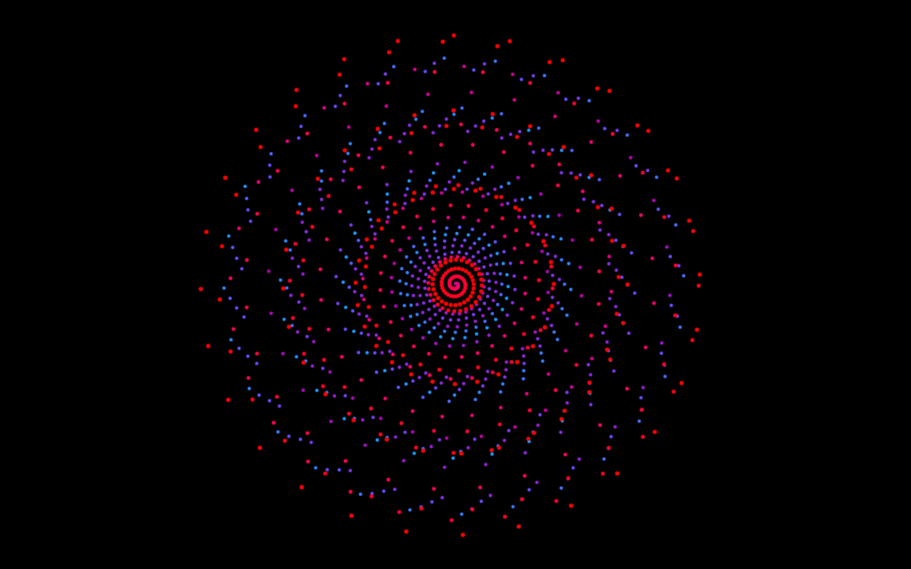
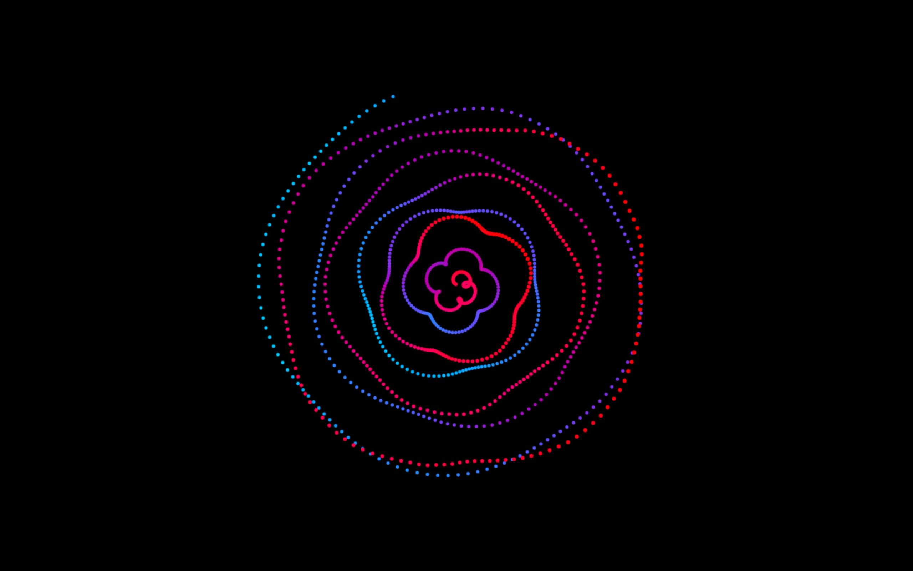
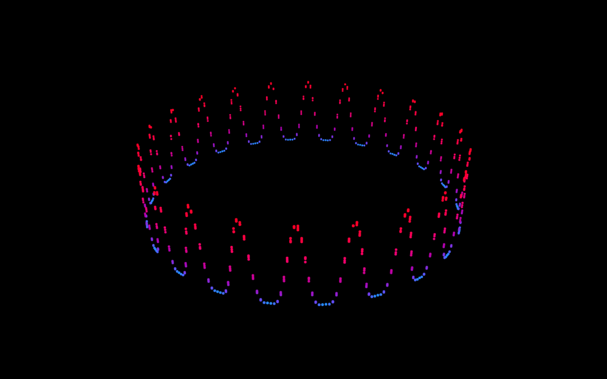

# Audible Visuals
## Audio visualizer created with THREE.js and Web Audio API
~ _Featured on [Chrome Experiments](https://www.chromeexperiments.com/experiment/audible-visuals "Chrome Experiemnts - Audible Visuals by Sonia Boller")_ ~
---
### Summary
Drag and drop a song from your computer and visualize the tunes. Visualizations are created by analyzing the waveform and frequency data through the Web Audio API and then rendered in canvas with THREE.js. Each of the visualizations is a permutation of the Archimedean Spiral. There are four different visualizers that can be seamlessly toggled through while playing a song using keyboard controls, as well as three different color schemes. Additionally, GUI controls can be accessed for even more manipulation and experimentation.
  
Play around!! It's mind blowing how visually different songs can be.
  

### Keyboard Controls
* 'a' : starts and stops animation
* 'space' : starts and stops song
* '1' : spiral visualizer 
* '2' : wavy spiral visualizer 
* '3' : flower visualizer 
* '4' : circle visualizer 
* 'r' : emphasizes red in the visualizer
* 'g' : emphasizes green in the visualizer
* 'b' : emphasizes blue in the visualizer
* 'shift' and '+' : increases intensity 
* 'shift' and '-' : decreases intensity
* 'h' : toggles hidden controls
